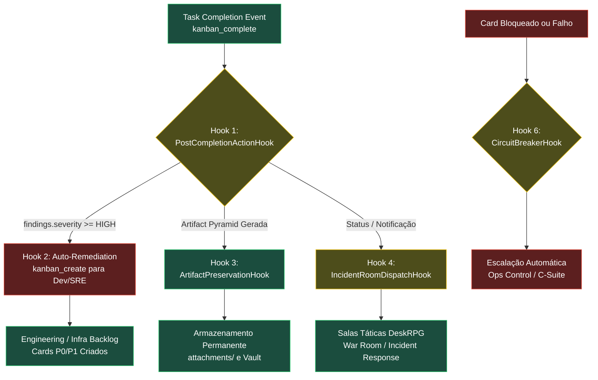

# Arquitetura de Hooks de Ciclo de Vida Autônomo (HIVE — DeskRPG + Hermes)

Documento oficial de especificação dos **Hooks de Automação de Ciclo de Vida**.  
Resolve o problema fundamental da **"Ilha de Execução Solitária"** (onde um agente roda uma tarefa, detecta falhas ou conclui a auditoria, dá `kanban_complete` e morre sem ninguém ler, sem desdobrar tarefas de correção e sem notificar as salas de comando).

---

## 1. O Diagnóstico do Gargalo Atual

Atualmente, o fluxo operacional quebra no momento em que um agente dá `kanban_complete`:

```
┌─────────────────────────┐
│ Agente roda auditoria   │ (Ex: security-engineer detecta 2 RCEs e 10 certs expirados)
└────────────┬────────────┘
             ▼
┌─────────────────────────┐
│ kanban_complete()       │
└────────────┬────────────┘
             ▼
   ❌ GARGALO ATUAL: O QUE ACONTECE HOJE?
   1. O card vai para 'done'.
   2. O workspace temporário ('scratch') é DELETADO pelo Hermes.
   3. NENHUM card de correção é criado para o dev ou SRE consertar.
   4. NENHUMA sala tática (War Room, Incident Response) recebe o alerta.
   5. O relatório morre silenciosamente no banco de dados.
```

**Resultado:** Queima de tokens sem gerar valor monetizável, correção de falhas ou continuidade do negócio.

---

## 2. A Solução: Arquitetura em 6 Hooks Fundamentais

Para a empresa ser **100% autônoma e resiliente**, a transição de qualquer card deve acionar ganchos automáticos de eventos que fecham o circuito:



---

## 3. Especificação Detalhada dos 6 Hooks

### Hook 1 — `PostCompletionActionHook` (Auto-Triage & Remediation Dispatcher)

- **Local de Execução:** DeskRPG Event Sink (`src/server/automation-events.ts`) ou Hermes Kanban Plugin (`hooks/task_completion.py`).
- **Gatilho:** Evento `task.status` com `to = "done"` ou `task.run.finished`.
- **Responsabilidade:** Inspecionar os metadados do run final (`task_runs.metadata`). Se houver indicadores de vulnerabilidade, falha ou débito detectado:
  1. Analisa as chaves: `cve_critical_count`, `cve_findings`, `ssl_expired_certs_count`, `flaky_tests`, `errors`.
  2. Se `severity == "CRITICAL" | "HIGH"`:
     - Invoca `kanban_create` no board competente (`Engineering` ou `Infrastructure`).
     - Atribui automaticamente ao executor responsável (`backend-engineer` para CVEs de código; `site-reliability-engineer` para certificados/infra; `debugger` para crashes).
     - Vincula a tarefa original como `parent` para manter rastreabilidade total.

---

### Hook 2 — `IncidentRoomDispatchHook` (Notificação Granular em Salas Táticas)

- **Local de Execução:** `src/server/automation-events.ts` (função `postNotice`).
- **Gatilho:** Qualquer transição para `card_blocked`, `card_done` (com anomalias) ou `cron.error`.
- **Problema Atual:** O código atual envia mensagens apenas para o chat geral (`Office` / "Whole Office") como aviso passivo de sistema. Ninguém escuta.
- **Comportamento do Hook:**
  - Roteamento por domínio de combate:
    - **Segurança & Infraestrutura:** Dispara aviso na sala **`Incident Response`** e **`NOC`** com menção direta:  
      `@site-reliability-engineer @cto 🚨 Auditoria detectou certificados vencidos e 2 RCEs. Cards de remediação criados.`
    - **Falhas de Teste e QA:** Dispara aviso na sala **`War Room`** com menção direta:  
      `@debugger @backend-engineer ⚠️ Testes quebrados na suíte. Diagnóstico iniciado.`
    - **Bloqueios de Produto/Spec:** Dispara na sala **`Product Office`**:  
      `@product-manager @implementation-planner Card bloqueado por ambiguidade de aceite.`

---

### Hook 3 — `ArtifactPreservationHook` (Persistência da Pirâmide de Artefatos)

- **Local de Execução:** Hermes Gateway / Dispatcher Runtime (`kanban_dispatcher.py`).
- **Gatilho:** Evento anterior ao `cleanup` do workspace efêmero (`workspace_kind: 'scratch'`).
- **Problema Atual:** O Hermes só copia para `attachments/` o arquivo declarado pontualmente no array `artifacts`. O restante da pasta temporária (`01-summary/`, `02-analysis/`, `03-dossiers/`) é deletado do disco, destruindo os dados brutos da auditoria.
- **Comportamento do Hook:**
  - Detecta se a raiz do workspace possui um `00-index.md` (formato de Pirâmide de Artefatos).
  - Copia **recursivamente** toda a árvore de diretórios para o armazenamento permanente em:  
    `~/.hermes/kanban/boards/<board_slug>/attachments/<task_id>/`
  - Garante que L1 (Summary), L2 (Analysis) e L3 (Dossiers) permaneçam acessíveis no DeskRPG via API de visualização de artefatos.

---

### Hook 4 — `ReviewGateTransitionHook` (Handoff Automático de Code Review & PR)

- **Local de Execução:** Hermes Kanban Lifecycle Controller (`kanban_transitions.py`) + DeskRPG Poller.
- **Gatilho:** Card movido para `status = 'review'` ou pull request aberto no GitHub.
- **Comportamento do Hook:**
  - O kernel do Kanban automaticamente resolve o `reviewer` ativo no canal (graças à nossa padronização do `DEFAULT_REVIEWER_PROFILE = "reviewer"`).
  - Spawna imediatamente o `reviewer` em sessão background para auditar o diff do PR.
  - **Se o Reviewer Aprovar:** Promove o card para o `verifier` dar o sign-off final.
  - **Se o Reviewer Reprovar:** Dispara `kanban_request_changes`, retorna o card para `todo` ou `running` atribuído ao desenvolvedor original com a lista exata dos itens bloqueantes e notifica a sala `Dev Lab`.

---

### Hook 5 — `OrchestratorFeedbackLoopHook` (Sentinela de Fechamento de Épicos)

- **Local de Execução:** Agendador de Sentinela Periódica (`cron_job_origins`).
- **Gatilho:** Executado a cada 4 horas pelo `orchestrator` e `kanban-strategist`.
- **Comportamento do Hook:**
  - O `orchestrator` lê todos os cards em `done` nas últimas 4 horas.
  - Compara as entregas com as metas estratégicas ativas no canal.
  - Se um épico teve todas as tarefas concluídas, o Orchestrator compila a Release Note, atualiza o status macro para o **C-Suite** e fecha o ciclo de entrega.

---

### Hook 6 — `CircuitBreakerDeadlockHook` (Anti-Loop e Escalação de Falhas)

- **Local de Execução:** Dispatcher Watchdog (`kanban_dispatcher.py`).
- **Gatilho:** Tarefa acumulando `consecutive_failures >= 3` ou tempo de execução excedido (`max_runtime_seconds`).
- **Comportamento do Hook:**
  - Trava a tarefa em `status = 'blocked'` com `block_kind = 'capability'`.
  - Impede que o Dispatcher tente spawnar a tarefa infinitamente e queime tokens em loop.
  - Envia um SALUTE formal na sala **`Ops Control`** de Operações informando a falha não recuperável para análise da liderança.

---

### Hook 7 — `StarvationSentinelHook` (Alimentação Contínua de Backlog)

- **Local de Execução:** DeskRPG Lifecycle Hooks (`autonomous-lifecycle-hooks.ts`).
- **Gatilho:** 0 tarefas ativas (`ready`, `running`, `review`) em qualquer um dos 4 boards de produto.
- **Comportamento do Hook:** Aciona imediatamente o `product-manager` e `implementation-planner` para decompor metas e manter a tripulação alimentada.

---

### Hook 8 — `BlockerTriageHook` (Triagem Ativa de Bloqueio & Auto-Remediação)

- **Local de Execução:** DeskRPG Event Sink (`automation-events.ts` -> `autonomous-lifecycle-hooks.ts`).
- **Gatilho:** Evento `task.status` com `to = "blocked"`.
- **Comportamento do Hook (5 Ramos Cirúrgicos):**
  - **Ramo A — Workspace Scratch Vazio (Nível L1):** Converte automaticamente o workspace para `worktree` ou `dir` apontando para o repositório do projeto, limpa erros, move o status para `ready` e relança o dispatcher.
  - **Ramo B — Quebra de Dependências / .venv (Nível L2):** Detecta `ImportError`, `ModuleNotFoundError` ou ferramentas ausentes. Cria imediatamente tarefa `[P0-ENV-FIX]` para `@platform-engineer` / `@site-reliability-engineer`, vincula o card original como dependente em `todo` até a conclusão do reparo e notifica a sala tática.
  - **Ramo C — Critério de Aceite Ambíguo (`needs_input`, Nível L2):** Cria card de decisão executiva `[P0-DECISÃO]` para o `@product-manager` reformular critérios de aceite ou autorizar sign-off simulado, permitindo o `kanban_unblock`.
  - **Ramo D — Quota, HTTP 429, Limite de Sessão 6/6 e Modelos Inválidos (Nível L1):** Purga leases de sessões órfãs em `active_sessions.json`, zera `model_override = NULL` e `provider_override = NULL` diretamente no banco, limpa `last_failure_error` e redefine o card para `ready`, permitindo a retomada limpa com o modelo estável do profile.
  - **Ramo E — Bloqueios de Capability / Credenciais / Owner-Gated (Nível L3):** Caso o card esteja bloqueado por restrições intransponíveis (chaves mTLS, autorização bancária, credenciais privadas do Soberano ou falhas recorrentes não cobertas em L1/L2), o hook **nunca silencia**. Ele cria automaticamente um card de triagem executiva `[P0-OWNER-TRIAGE]` atribuído a `@product-manager` / `@orchestrator` com alerta P0 no `Ops Control` e `War Room`.

---

### Hook 9 — `QuotaModelSentinelHook` (Sentinela Autônomo de Quota, Modelo e Concorrência)

- **Local de Execução:** Hermes Cron (a cada 15min) + Sentinel Reativo (`backlog_starvation_sentinel.py` e `executeQuotaModelSentinelLifecycle`).
- **Gatilho:** Cron recorrente de 15 minutos ou varredura de emergência pós-queda.
- **Custo:** 0 tokens LLM (execução 100% determinística via script SQLite).
- **Comportamento do Hook:**
  1. **Auditoria de Sessões:** Inspeciona `active_sessions.json` de todos os profiles Hermes e purga leases cujo PID local já encerrou, liberando vagas antes de bater no teto de `6/6 sessões`.
  2. **Purga Incondicional de Overrides:** Executa `UPDATE tasks SET model_override = NULL, provider_override = NULL` em todos os boards de produto, eliminando contaminações de scripts legados e garantindo herança estrita do profile.
  3. **Auto-Unblock de Quota e 429:** Localiza tarefas paralisadas em `blocked` por quota, rate limit HTTP 429 ou esgotamento de slots, registra comentário explicativo, limpa os campos de falha e promove automaticamente para `ready`.
  4. **Watchdog de Backlog Starvation:** Se qualquer board de produto atingir 0 tarefas ativas (`ready = 0`, `running = 0`, `todo = 0`), aciona imediatamente o `implementation-planner` (respeitando cooldown de 15min) para fatiar novas demandas estratégicas.

---

## 4. Matriz de Mapeamento dos Hooks por Componente

| Hook ID   | Nome do Gancho           | Onde Implementar                          | Gatilho de Disparo                  | Ação Executada                                                                      |
| :-------- | :----------------------- | :---------------------------------------- | :---------------------------------- | :---------------------------------------------------------------------------------- |
| **HK-01** | `PostCompletionAction`   | DeskRPG (`automation-events.ts`)          | Card atinge `done` com findings     | Cria tarefas de remediação (`kanban_create`) para Dev/SRE.                          |
| **HK-02** | `IncidentRoomDispatch`   | DeskRPG (`automation-events.ts`)          | Card crítico concluído ou bloqueado | Publica alerta com `@mention` na sala tática específica do tema.                    |
| **HK-03** | `ArtifactPreservation`   | Hermes (`kanban_dispatcher.py`)           | Pre-cleanup de workspace `scratch`  | Copia recursivamente L1/L2/L3 da pirâmide para `attachments/`.                      |
| **HK-04** | `ReviewGateTransition`   | Hermes (`kanban_transitions.py`)          | Card entra em `review`              | Spawna `reviewer`, aprova ou solicita mudanças automaticamente.                     |
| **HK-05** | `OrchestratorFeedback`   | Hermes Cron (`orchestrator`)              | A cada 4h (varredura de `done`)     | Valida encerramento de épicos e alimenta novas metas no backlog.                    |
| **HK-06** | `CircuitBreakerDeadlock` | Hermes Dispatcher Watchdog                | `consecutive_failures >= 3`         | Isola o card em quarentena e alerta o `Ops Control`.                                |
| **HK-07** | `StarvationSentinel`     | DeskRPG (`autonomous-lifecycle-hooks.ts`) | 0 tarefas ativas no board           | Aciona PM/Planner para gerar novos cards.                                           |
| **HK-08** | `BlockerTriage`          | DeskRPG (`autonomous-lifecycle-hooks.ts`) | Card transiciona para `blocked`     | Auto-remedia scratch/quota/sessão, despacha P0 de ambiente, decisão ou Owner.       |
| **HK-09** | `QuotaModelSentinel`     | Hermes Cron + DeskRPG Sentinel            | A cada 15min (ou sob demanda)       | Purga overrides, destrava cards por 429/quota e monitora starvation com custo zero. |

---

## 5. Roteiro de Implementação Física

Para transformar a HIVE em uma máquina 100% autônoma que fecha o circuito:

1. **Fase 1 (DeskRPG Events & Salas):**  
   Implementar **HK-01** e **HK-02** dentro de `src/server/automation-events.ts`.  
   Toda vez que um card de auditoria der `done`, o backend do DeskRPG lê os achados e cria os cards de correção nos boards certos, além de notificar a sala tática.

2. **Fase 2 (Hermes Artifacts & Dispatch):**  
   Implementar **HK-03** no script do dispatcher do Hermes para nunca mais perder os dados brutos de auditorias em workspaces temporários.

3. **Fase 3 (Garantia de Não-Intervenção):**  
   O usuário/Soberano nunca mais precisa ser perguntado se deseja criar tarefas de correção. Os próprios hooks convertem diagnósticos em ordens de serviço executáveis.

---

## 6. Governança da Arquitetura Híbrida (Hooks Reativos vs. Crons Diários em Batch)

### O Problema do Polling Cego (Depreciação de Crons Curtos)

Crons recorrentes de frequência agressiva (`every 5m`, `every 10m`, `every 60m`) que disparam agentes LLM geravam três falhas críticas no ecossistema:

1. **Saturação de Sessões:** O Hermes atingia o teto simultâneo de `6/6 sessões ativas`, congelando o dispatcher.
2. **Rate Limiting da API:** Disparos contínuos provocavam `HTTP 429 (usage limit)` e `HTTP 400` por tentativas com modelos incompatíveis.
3. **Tempestades de Concorrência:** Duplicatas de cron configuradas em múltiplos perfis auxiliares (ex: `implementation-planner` e `technical-writer`) disparavam simultaneamente às 09:00, 10:00 e 16:00.

### O Modelo Híbrido Definitivo

- **Hooks Reativos (Tempo Real / Event-Driven):** O agente dorme em idle até que um fato mensurável ocorra (`card_blocked`, `card_done`, `review_requested`, `starvation`). O hook (`HK-01` a `HK-08`) atua imediatamente com custo zero em repouso.
- **Crons Diários em Batch (Buffer de 24h):** Cada especialista mantém no máximo **1 cron diário**, distribuído em horários escalonados para evitar concorrência. Esse cron atua como buffer para varrer o lote acumulado, reavaliar metas do dia e garantir higiene dos boards:
  - `08:30` — SRE / Ops (Health check e estabilidade de infra)
  - `09:00` — Product Manager (`0835c21f06fa` — Triagem, prioridades e backlog)
  - `09:30` — Researcher (`ab85d4023023` — Sinais de mercado e concorrentes)
  - `10:00` — Spec-Driven-Development (`ce02f446fa60` — Especificações e critérios de aceite)
  - `16:00` — Reviewer (`731166937065` — Gates de qualidade e revisão de PRs)
  - `16:30` — Feature Rollout (`86dc87498a97` — Estabilidade pós-deploy)
- **Auditoria de Faxina:** 21 crons agressivos/duplicados foram pausados nos perfis Hermes, garantindo throughput contínuo e eliminando o travamento do gateway.

---

## 7. Pipeline de Fusão de Pull Requests em 5 Portões (GitHub Webhooks)

Implementado em `src/lib/github-lifecycle-hooks.ts` e exposto via `POST /api/webhooks/github`:

### O Funil dos 5 Portões de Fusão

| Portão                       | Responsável        | Evento de Disparo                     | Ação do Hook                                                                               | Critério de Passagem                                       |
| :--------------------------- | :----------------- | :------------------------------------ | :----------------------------------------------------------------------------------------- | :--------------------------------------------------------- |
| **Gate 1 (Mergeable)**       | GitHub Sentinel    | `pull_request.opened` / `synchronize` | Se `mergeable === false`, bloqueia o card (`kind: conflict`) e alerta o dev para rebase.   | Sem conflitos com a branch base.                           |
| **Gate 2 (CI/Checks)**       | GitHub CI Sentinel | `check_suite.completed`               | Se `failure`, bloqueia o card (`kind: capability`). Se `success`, aciona o `@qa-engineer`. | 100% verde no GitHub Actions.                              |
| **Gate 3 (Code Review)**     | `@reviewer`        | `pull_request_review.submitted`       | Se `changes_requested`, retorna para o dev. Se `approved`, convoca o `@product-manager`.   | Aprovação formal da engenharia (`gh pr review --approve`). |
| **Gate 4 (QA Homologation)** | `@qa-engineer`     | `issue_comment` (no PR)               | QA homologa cenários em staging, podendo comitar testes adicionais na branch.              | Comentário formal `[QA-APROVADO]` no PR.                   |
| **Gate 5 (PM Acceptance)**   | `@product-manager` | `issue_comment` (no PR)               | PM valida critérios de aceite do card e negócio, emitindo o sign-off final.                | Comentário formal `[APROVADO]` do PM.                      |

### Fusão Segura & Regra Inviolável de Transição para 'Done'

1. **Permanência Obrigatória em 'Review':** Enquanto o PR estiver tramitando nos 5 Portões de Fusão, o card no Kanban **deve permanecer estritamente na coluna `review`** (ou `blocked` em caso de conflito ou quebra de CI).
2. **Intercepção de 'Done' Antecipado (`enforceReviewGateForPrTasks`):** O `automation-events.ts` intercepta qualquer tentativa de mover um card vinculado a PR aberto para `done`, revertendo o status para `review` e alertando a sala tática.
3. **Merge Efetivo como Gatilho Exclusivo:** O card só é promovido para `done` quando o webhook do GitHub confirma o merge real (`action: 'closed'`, `merged: true`) após a aprovação de todos os 5 portões.

---

## 8. Governança de Níveis de Interação do Kanban (L1, L2, L3)

Para eliminar o risco de "tarefas órfãs" e garantir 100% de autonomia sem intervenção humana acidental, as tarefas e bloqueios são rigorosamente classificados em 3 níveis operacionais:

### A Pirâmide de Níveis Operacionais

| Nível  | Classificação                        | Escopo & Comportamento                                                                                                                     | Responsáveis & Ações                                                                                                                                                                                                                                                                  |
| :----- | :----------------------------------- | :----------------------------------------------------------------------------------------------------------------------------------------- | :------------------------------------------------------------------------------------------------------------------------------------------------------------------------------------------------------------------------------------------------------------------------------------ |
| **L1** | **Quick / Auto-Remediated**          | Resoluções mecânicas, determinísticas e de custo zero em tokens. Executado imediatamente pelo kernel do DeskRPG ou pelo sentinela do cron. | **Hooks HK-08 / HK-09:** Auto-heal de workspace scratch vazio para worktree, purga de leases órfãos em `active_sessions.json`, limpeza incondicional de `model_override` / `provider_override` e auto-unblock de rate limits temporários (HTTP 429).                                  |
| **L2** | **Complex / Specialist Remediation** | Desafios técnicos que exigem raciocínio especializado de agentes, mas sem necessidade de intervenção do Soberano.                          | **Especialistas via Cards P0:** Quebra de ambiente `.venv` (`[P0-ENV-FIX]` -> `@platform-engineer`), ambiguidade em critérios de aceite (`[P0-DECISÃO]` -> `@product-manager`), homologação de PRs (`@qa-engineer` / `@reviewer`). O card original aguarda em `todo` como dependente. |
| **L3** | **Owner-Gated / Executive Triage**   | Bloqueios intransponíveis por agentes que demandam segredos físicos, decisões financeiras ou autorizações exclusivas do Soberano.          | **C-Suite & Salas de Comando:** Criação automática de `[P0-OWNER-TRIAGE]` atribuído ao `@product-manager` / `@orchestrator`. Alertas imediatos nas salas `Ops Control` e `War Room`.                                                                                                  |

### A Regra de Ouro da Automação de Quota, Modelo e Sessão

> **REGRA FUNDAMENTAL:**
>
> 1. Quando uma tarefa é bloqueada com `block_kind = 'quota'` ou `block_kind = 'model'` (ou registra erros transitórios de rate limit HTTP 429 / sessão 6/6), o sistema executa **auto-remediação imediata em nível L1**: limpa leases órfãos, zera os campos `model_override` e `provider_override` para garantir que o worker herde o modelo estável padrão do profile, e redefine o status para `ready`.
> 2. Se o bloqueio for de infraestrutura física, credenciais externas, mTLS bancário ou persistir após auto-remediação, o `BlockerTriageHook` (HK-08) **nunca deixa o card morrer silenciosamente em `blocked`**: ele escala imediatamente a tarefa para **Nível L3**, gerando um card `[P0-OWNER-TRIAGE]` para a liderança executiva tomar providências e disparando alerta na sala tática.

---

## 9. Resolução Definitiva da Proliferação e Recursão de Tarefas (Root-Cause Fix)

### 9.1. O Diagnóstico da Causa Raiz da Explosão

A criação massiva de mais de 440 cartões idênticos de `[P0-OWNER-TRIAGE]` decorria de 3 falhas combinadas no motor de eventos:

1. **Recursão Infinita Sem Trava:** Quando um card de triagem `[P0-OWNER-TRIAGE]` sofria falha ou bloqueio, o `BlockerTriageHook` era acionado sobre ele mesmo, criando uma triagem da triagem (`[P0-OWNER-TRIAGE] Triagem executiva L3 para card bloqueado t_triage_...`), deflagrando uma árvore binária exponencial (exatamente 63 cópias por raiz).
2. **Perda do Marcador de Deduplicação:** O `insertTaskSafely` verificava `body LIKE '%dedupKey%'`, mas não persistia o marcador `<!-- dedupKey -->` no corpo do cartão caso o chamador omitisse a tag. Assim, a cada verificação subsequente o banco retornava nulo e criava um novo card. Além disso, a busca por título idêntico era ignorada quando um `dedupKey` era fornecido.
3. **Ausência de Teto de Triagem por Board:** Múltiplos bloqueios em um mesmo board criavam dezenas de cartões de triagem independentes em vez de consolidar os incidentes.

### 9.2. As 3 Barreira de Proteção Implementadas

1. **Guarda de Recursão Rígida (Recursion Guard):**
   - Se o card bloqueado possuir no título `[P0-OWNER-TRIAGE]`, `[P0-DECISÃO]`, `[P0-ENV-FIX]` ou `[EPIC-TRIAGE]`, o hook **rejeita categoricamente a criação de qualquer nova tarefa**, coloca o card em quarentena (`block_kind = 'quarantine'`) e encerra o ciclo.
2. **Teto de Triagem por Board (Board-Level Triage Cap):**
   - É estritamente proibido existir mais de 1 card de triagem executiva ativo por board. Bloqueios subsequentes são agregados via comentário e dependência ao card de triagem existente (`owner_triage_aggregated`).
3. **Persistência Forçada de `dedupKey` & Idempotência por Título:**
   - O `insertTaskSafely` agora injeta incondicionalmente a tag `<!-- dedupKey: ${spec.dedupKey} -->` no corpo da tarefa e valida simultaneamente a duplicidade por `dedupKey` e por título exato. Tarefas já existentes retornam `already_exists` imediatamente.
