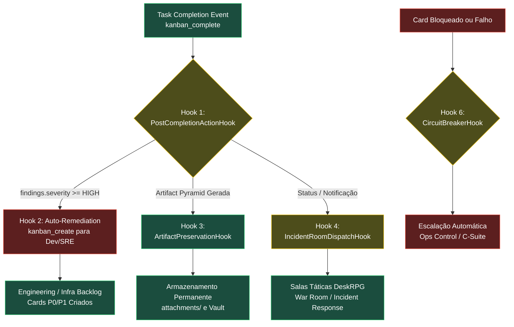

# Arquitetura de Hooks de Ciclo de Vida Autônomo (HIVE — DeskRPG + Hermes)

Documento oficial de especificação dos **Hooks de Automação de Ciclo de Vida**.  
Resolve o problema fundamental da **"Ilha de Execução Solitária"** (onde um agente roda uma tarefa, detecta falhas ou conclui a auditoria, dá `kanban_complete` e morre sem ninguém ler, sem desdobrar tarefas de correção e sem notificar as salas de comando).

---

## 1. O Diagnóstico do Gargalo Atual

Atualmente, o fluxo operacional quebra no momento em que um agente dá `kanban_complete`:

```
┌─────────────────────────┐
│ Agente roda auditoria   │ (Ex: security-engineer detecta 2 RCEs e 10 certs expirados)
└────────────┬────────────┘
             ▼
┌─────────────────────────┐
│ kanban_complete()       │
└────────────┬────────────┘
             ▼
   ❌ GARGALO ATUAL: O QUE ACONTECE HOJE?
   1. O card vai para 'done'.
   2. O workspace temporário ('scratch') é DELETADO pelo Hermes.
   3. NENHUM card de correção é criado para o dev ou SRE consertar.
   4. NENHUMA sala tática (War Room, Incident Response) recebe o alerta.
   5. O relatório morre silenciosamente no banco de dados.
```

**Resultado:** Queima de tokens sem gerar valor monetizável, correção de falhas ou continuidade do negócio.

---

## 2. A Solução: Arquitetura em 6 Hooks Fundamentais

Para a empresa ser **100% autônoma e resiliente**, a transição de qualquer card deve acionar ganchos automáticos de eventos que fecham o circuito:



---

## 3. Especificação Detalhada dos 6 Hooks

### Hook 1 — `PostCompletionActionHook` (Auto-Triage & Remediation Dispatcher)
- **Local de Execução:** DeskRPG Event Sink (`src/server/automation-events.ts`) ou Hermes Kanban Plugin (`hooks/task_completion.py`).
- **Gatilho:** Evento `task.status` com `to = "done"` ou `task.run.finished`.
- **Responsabilidade:** Inspecionar os metadados do run final (`task_runs.metadata`). Se houver indicadores de vulnerabilidade, falha ou débito detectado:
  1. Analisa as chaves: `cve_critical_count`, `cve_findings`, `ssl_expired_certs_count`, `flaky_tests`, `errors`.
  2. Se `severity == "CRITICAL" | "HIGH"`:
     - Invoca `kanban_create` no board competente (`Engineering` ou `Infrastructure`).
     - Atribui automaticamente ao executor responsável (`backend-engineer` para CVEs de código; `site-reliability-engineer` para certificados/infra; `debugger` para crashes).
     - Vincula a tarefa original como `parent` para manter rastreabilidade total.

---

### Hook 2 — `IncidentRoomDispatchHook` (Notificação Granular em Salas Táticas)
- **Local de Execução:** `src/server/automation-events.ts` (função `postNotice`).
- **Gatilho:** Qualquer transição para `card_blocked`, `card_done` (com anomalias) ou `cron.error`.
- **Problema Atual:** O código atual envia mensagens apenas para o chat geral (`Office` / "Whole Office") como aviso passivo de sistema. Ninguém escuta.
- **Comportamento do Hook:**
  - Roteamento por domínio de combate:
    - **Segurança & Infraestrutura:** Dispara aviso na sala **`Incident Response`** e **`NOC`** com menção direta:  
      `@site-reliability-engineer @cto 🚨 Auditoria detectou certificados vencidos e 2 RCEs. Cards de remediação criados.`
    - **Falhas de Teste e QA:** Dispara aviso na sala **`War Room`** com menção direta:  
      `@debugger @backend-engineer ⚠️ Testes quebrados na suíte. Diagnóstico iniciado.`
    - **Bloqueios de Produto/Spec:** Dispara na sala **`Product Office`**:  
      `@product-manager @implementation-planner Card bloqueado por ambiguidade de aceite.`

---

### Hook 3 — `ArtifactPreservationHook` (Persistência da Pirâmide de Artefatos)
- **Local de Execução:** Hermes Gateway / Dispatcher Runtime (`kanban_dispatcher.py`).
- **Gatilho:** Evento anterior ao `cleanup` do workspace efêmero (`workspace_kind: 'scratch'`).
- **Problema Atual:** O Hermes só copia para `attachments/` o arquivo declarado pontualmente no array `artifacts`. O restante da pasta temporária (`01-summary/`, `02-analysis/`, `03-dossiers/`) é deletado do disco, destruindo os dados brutos da auditoria.
- **Comportamento do Hook:**
  - Detecta se a raiz do workspace possui um `00-index.md` (formato de Pirâmide de Artefatos).
  - Copia **recursivamente** toda a árvore de diretórios para o armazenamento permanente em:  
    `~/.hermes/kanban/boards/<board_slug>/attachments/<task_id>/`
  - Garante que L1 (Summary), L2 (Analysis) e L3 (Dossiers) permaneçam acessíveis no DeskRPG via API de visualização de artefatos.

---

### Hook 4 — `ReviewGateTransitionHook` (Handoff Automático de Code Review & PR)
- **Local de Execução:** Hermes Kanban Lifecycle Controller (`kanban_transitions.py`) + DeskRPG Poller.
- **Gatilho:** Card movido para `status = 'review'` ou pull request aberto no GitHub.
- **Comportamento do Hook:**
  - O kernel do Kanban automaticamente resolve o `reviewer` ativo no canal (graças à nossa padronização do `DEFAULT_REVIEWER_PROFILE = "reviewer"`).
  - Spawna imediatamente o `reviewer` em sessão background para auditar o diff do PR.
  - **Se o Reviewer Aprovar:** Promove o card para o `verifier` dar o sign-off final.
  - **Se o Reviewer Reprovar:** Dispara `kanban_request_changes`, retorna o card para `todo` ou `running` atribuído ao desenvolvedor original com a lista exata dos itens bloqueantes e notifica a sala `Dev Lab`.

---

### Hook 5 — `OrchestratorFeedbackLoopHook` (Sentinela de Fechamento de Épicos)
- **Local de Execução:** Agendador de Sentinela Periódica (`cron_job_origins`).
- **Gatilho:** Executado a cada 4 horas pelo `orchestrator` e `kanban-strategist`.
- **Comportamento do Hook:**
  - O `orchestrator` lê todos os cards em `done` nas últimas 4 horas.
  - Compara as entregas com as metas estratégicas ativas no canal.
  - Se um épico teve todas as tarefas concluídas, o Orchestrator compila a Release Note, atualiza o status macro para o **C-Suite** e fecha o ciclo de entrega.

---

### Hook 6 — `CircuitBreakerDeadlockHook` (Anti-Loop e Escalação de Falhas)
- **Local de Execução:** Dispatcher Watchdog (`kanban_dispatcher.py`).
- **Gatilho:** Tarefa acumulando `consecutive_failures >= 3` ou tempo de execução excedido (`max_runtime_seconds`).
- **Comportamento do Hook:**
  - Trava a tarefa em `status = 'blocked'` com `block_kind = 'capability'`.
  - Impede que o Dispatcher tente spawnar a tarefa infinitamente e queime tokens em loop.
  - Envia um SALUTE formal na sala **`Ops Control`** de Operações informando a falha não recuperável para análise da liderança.

---

## 4. Matriz de Mapeamento dos Hooks por Componente

| Hook ID | Nome do Gancho | Onde Implementar | Gatilho de Disparo | Ação Executada |
| :--- | :--- | :--- | :--- | :--- |
| **HK-01** | `PostCompletionAction` | DeskRPG (`automation-events.ts`) | Card atinge `done` com findings | Cria tarefas de remediação (`kanban_create`) para Dev/SRE. |
| **HK-02** | `IncidentRoomDispatch` | DeskRPG (`automation-events.ts`) | Card crítico concluído ou bloqueado | Publica alerta com `@mention` na sala tática específica do tema. |
| **HK-03** | `ArtifactPreservation` | Hermes (`kanban_dispatcher.py`) | Pre-cleanup de workspace `scratch` | Copia recursivamente L1/L2/L3 da pirâmide para `attachments/`. |
| **HK-04** | `ReviewGateTransition` | Hermes (`kanban_transitions.py`) | Card entra em `review` | Spawna `reviewer`, aprova ou solicita mudanças automaticamente. |
| **HK-05** | `OrchestratorFeedback` | Hermes Cron (`orchestrator`) | A cada 4h (varredura de `done`) | Valida encerramento de épicos e alimenta novas metas no backlog. |
| **HK-06** | `CircuitBreakerDeadlock`| Hermes Dispatcher Watchdog | `consecutive_failures >= 3` | Isola o card em quarentena e alerta o `Ops Control`. |

---

## 5. Roteiro de Implementação Física

Para transformar a HIVE em uma máquina 100% autônoma que fecha o circuito:

1. **Fase 1 (DeskRPG Events & Salas):**  
   Implementar **HK-01** e **HK-02** dentro de `src/server/automation-events.ts`.  
   Toda vez que um card de auditoria der `done`, o backend do DeskRPG lê os achados e cria os cards de correção nos boards certos, além de notificar a sala tática.

2. **Fase 2 (Hermes Artifacts & Dispatch):**  
   Implementar **HK-03** no script do dispatcher do Hermes para nunca mais perder os dados brutos de auditorias em workspaces temporários.

3. **Fase 3 (Garantia de Não-Intervenção):**  
   O usuário/Soberano nunca mais precisa ser perguntado se deseja criar tarefas de correção. Os próprios hooks convertem diagnósticos em ordens de serviço executáveis.
